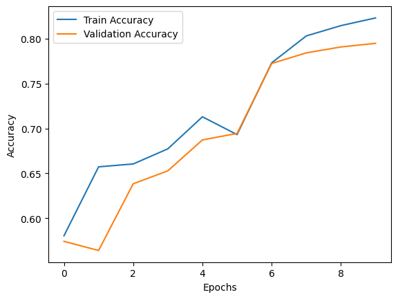
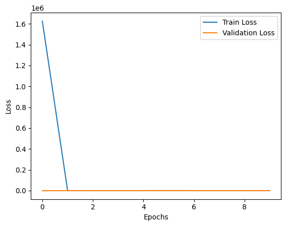

# Simple RNN IMDB Sentiment Analysis

## 📌 Overview
This project uses a Simple Recurrent Neural Network (RNN) to classify IMDB movie reviews as **positive** or **negative** sentiments.

The model is trained using TensorFlow/Keras on the built-in IMDB dataset.  
The main goal of this project is to understand **text preprocessing, sequence padding, and RNN-based sentiment classification**.

---

## 🧠 What It Does
- Loads the IMDB movie review dataset
- Converts text reviews into integer sequences
- Applies padding to maintain equal sequence length
- Trains a SimpleRNN neural network
- Evaluates model performance on test data

---

## 📊 Results
- The model successfully learns sentiment patterns from movie reviews.
- Training and validation accuracy improve gradually with epochs.
- Performance may vary depending on:
  - Number of epochs
  - Hardware limitations
  - Batch size and hyperparameters

> This project focuses on **learning RNN concepts** rather than achieving state-of-the-art accuracy.

---
## 🔍 Example Predictions

| Review | Predicted Sentiment |
|------|-------------------|
| I loved this movie it was amazing | Positive |
| The movie was boring and very slow | Positive (model limitation) |

## 📈 Training Visualizations

### Training vs Validation Accuracy


### Training vs Validation Loss



## ⚠️ Model Limitations

- This project uses a Simple RNN, which has limited ability to understand full sentence context.
- Some negative reviews may be misclassified as positive.
- The focus of this project is on understanding RNN fundamentals, not achieving production-level accuracy.
- Advanced models like LSTM or GRU can improve performance.


## 🛠 Tech Stack
- Python
- TensorFlow / Keras
- NumPy
- Matplotlib / Seaborn

---

## 🚀 How to Run

### 1️⃣ Clone the repository
```bash
git clone https://github.com/Vedantika1705/Simple-RNN-IMDB.git
cd Simple-RNN-IMDB
